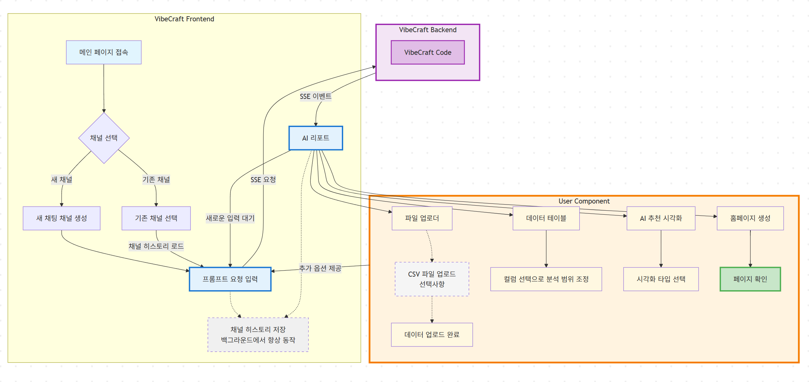
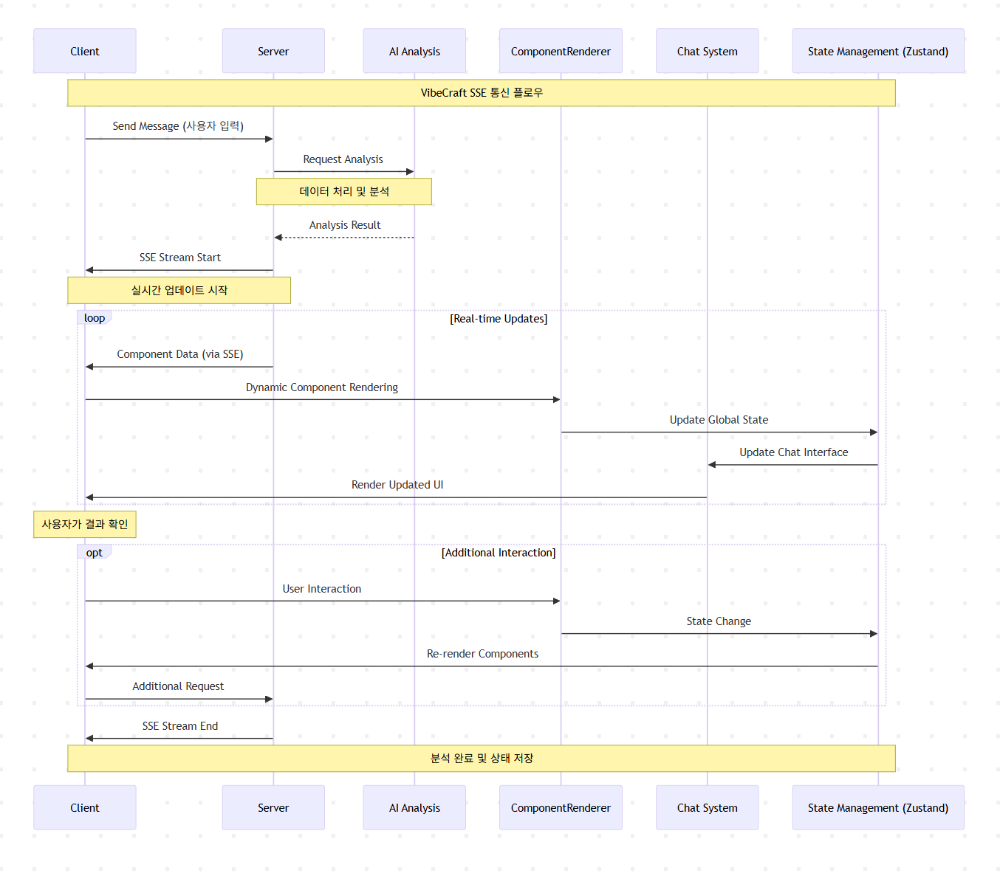

# VibeCraft

AI 기반 대화형 데이터 분석 및 시각화 플랫폼입니다. 자연어 채팅을 통해 데이터를 업로드하고, AI가 추천하는 최적의 시각화를 실시간으로 생성할 수 있습니다.

## 🚀 주요 기능

- **대화형 인터페이스**: AI와 채팅을 통한 직관적인 데이터 분석
- **실시간 스트리밍**: SSE(Server-Sent Events)를 통한 실시간 응답
- **다양한 데이터 지원**: CSV 파일 업로드 및 파싱
- **스마트 시각화**: AI가 추천하는 최적의 차트 및 지도 시각화
- **동적 컴포넌트**: 메뉴, 데이터 테이블, 시각화 컴포넌트 실시간 렌더링
- **채널 관리**: 여러 분석 세션을 채널별로 관리

## 🛠 기술 스택

### Frontend

- **React 18** + **TypeScript** + **Vite**
- **Ant Design** + **Tailwind CSS** (UI Framework)
- **Zustand** (상태 관리)
- **React Router DOM** (라우팅)

### 데이터 & 시각화

- **Recharts** (차트 라이브러리)
- **React Leaflet** (지도 시각화)
- **Papa Parse** (CSV 파싱)
- **IndexedDB** (클라이언트 스토리지)

### 통신 & 실시간

- **Axios** (HTTP 클라이언트)
- **EventSource Parser** (SSE 통신)
- **Server-Sent Events** (실시간 스트리밍)

### 개발 도구

- **ESLint** + **TypeScript** (코드 품질)
- **PostCSS** + **Autoprefixer** (CSS 처리)

## 📦 설치 및 실행

### 사전 요구사항

- Node.js 18 이상
- npm 또는 yarn

### 설치

```bash
# 저장소 클론
git clone https://github.com/MilkLotion/vibecraft.git
cd vibecraft

# 의존성 설치
npm install

# 환경 변수 설정
cp .env.example .env.development
# .env.development 파일을 열고 필요한 값들을 설정하세요

# 개발 서버 시작
npm run dev

# 브라우저에서 http://localhost:5173 접속 (기본 포트)
```

### 환경 변수 설정

`.env.development` 파일에 다음 환경 변수를 설정하세요:

```bash
# API Server Configuration
VITE_API_BASE_URL=http://localhost:22041
VITE_API_HOST=localhost
VITE_API_PORT=22041

# Client Configuration
VITE_CLIENT_HOST=localhost
VITE_CLIENT_PORT=22042

# Environment
VITE_NODE_ENV=development
```

### 빌드

```bash
# 타입 체크
npm run type-check

# ESLint 실행
npm run lint

# 프로덕션 빌드
npm run build

# 빌드 결과 미리보기
npm run preview
```

## 🏗 프로젝트 구조

```
vibecraft/
├── src/
│   ├── components/              # 재사용 가능한 컴포넌트
│   │   ├── Guide.tsx           # 가이드 컴포넌트
│   │   ├── Intro.tsx           # 인트로 컴포넌트
│   │   ├── Process.tsx         # 프로세스 컴포넌트
│   │   └── chat/               # 채팅 관련 컴포넌트
│   │       ├── ComponentRenderer.tsx  # 동적 컴포넌트 렌더러
│   │       ├── DataTable.tsx   # 데이터 테이블
│   │       ├── Markdown.tsx    # 마크다운 렌더러
│   │       ├── Menu.tsx        # 메뉴 컴포넌트
│   │       ├── Uploader.tsx    # 파일 업로더
│   │       └── Visualize.tsx   # 시각화 컴포넌트
│   ├── pages/                  # 페이지 컴포넌트
│   │   ├── Main.tsx           # 메인 페이지
│   │   ├── Sidebar.tsx        # 사이드바
│   │   ├── ChatView.tsx       # 채팅 뷰
│   │   ├── PromptBox.tsx      # 프롬프트 입력박스
│   │   └── Channels.tsx       # 채널 관리
│   ├── core/                   # 핵심 비즈니스 로직
│   │   ├── services/          # 서비스 레이어
│   │   │   ├── dataService.ts      # 데이터 처리 서비스
│   │   │   ├── messageService.ts   # 메시지 서비스
│   │   │   ├── sseService.ts       # SSE 통신 서비스
│   │   │   ├── storageService.ts   # 스토리지 서비스
│   │   │   └── streamService.ts    # 스트림 처리 서비스
│   │   ├── stores/            # Zustand 상태 관리
│   │   │   ├── channelStore.ts     # 채널 상태
│   │   │   ├── chatStore.ts        # 채팅 상태
│   │   │   ├── loadingStore.ts     # 로딩 상태
│   │   │   └── sseStore.ts         # SSE 상태
│   │   └── types/             # 타입 정의
│   │       ├── channel.ts          # 채널 타입
│   │       ├── chat.ts             # 채팅 타입
│   │       └── sse.ts              # SSE 타입
│   ├── hooks/                  # 커스텀 React 훅
│   │   ├── useChannel.ts      # 채널 관리 훅
│   │   ├── useFileUpload.ts   # 파일 업로드 훅
│   │   ├── useSSE.ts          # SSE 통신 훅
│   │   └── useStorage.ts      # 스토리지 훅
│   ├── utils/                  # 유틸리티 함수
│   │   ├── apiEndpoints.ts    # API 엔드포인트
│   │   ├── fileUtils.ts       # 파일 처리 유틸
│   │   └── streamProcessor.ts # 스트림 처리 유틸
│   ├── types/                  # 글로벌 타입
│   │   ├── session.ts         # 세션 타입
│   │   └── upload.ts          # 업로드 타입
│   ├── message/                # 메시지 관련
│   │   ├── chat_option.ts     # 채팅 옵션
│   │   └── prompt.ts          # 프롬프트 설정
│   ├── config/                 # 설정 파일
│   │   └── env.ts             # 환경 설정
│   └── styles/                 # 스타일 파일
│       └── index.css          # 글로벌 스타일
├── sample/                     # 샘플 데이터
│   ├── airtravel.csv          # 항공 여행 데이터
│   ├── sample_data.csv        # 샘플 데이터
│   └── ...                    # 기타 샘플 파일들
├── old_project/                # 아카이브된 이전 버전 파일들
├── dist/                       # 빌드 결과물
└── public/                     # 정적 파일들
```

## 🎯 사용 방법

### 1. 채널 선택 및 시작

- 메인 페이지 접속 후 채널을 선택합니다
  - **새 채널**: 새로운 분석 세션을 시작
  - **기존 채널**: 이전 분석 히스토리가 로드되어 이어서 작업 가능
- 하단의 프롬프트 박스에 데이터 분석 요청을 자연어로 입력

### 2. AI 기반 동적 컴포넌트 제공

AI가 요청을 분석한 후 상황에 맞는 컴포넌트들을 실시간으로 제공합니다:

#### 📁 데이터 업로드가 필요한 경우

- **파일 업로더 컴포넌트**가 자동으로 나타남
- CSV 파일을 드래그 앤 드롭하거나 클릭하여 업로드
- 업로드 완료 후 데이터 미리보기 제공

#### 📊 데이터 분석 및 조정

- **데이터 테이블 컴포넌트**를 통해 업로드된 데이터 확인
- 컬럼 선택으로 분석 범위 조정 가능
- AI가 데이터 특성을 자동으로 분석

#### 📈 시각화 생성

- **AI 추천 시각화 컴포넌트**가 최적의 차트 타입 제안
- 시각화 타입 선택 컴포넌트에서 원하는 형태 선택
- 차트, 지도, 대시보드 등 다양한 시각화 즉시 생성

#### 🏠 결과물 생성

- **홈페이지 생성 컴포넌트**로 완성된 분석 결과를 웹페이지로 제작
- 페이지 확인 및 추가 수정 요청 가능

### 3. 실시간 상호작용

- 각 단계에서 추가 요청이나 수정사항을 자연어로 입력
- AI가 즉시 대응하여 새로운 컴포넌트나 분석 결과 제공
- **백그라운드에서 채널 히스토리가 자동으로 저장**되어 언제든 복원 가능

### 4. 채널 관리 시스템

- 여러 분석 세션을 채널별로 독립적으로 관리
- 각 채널의 진행 상황과 전체 대화 히스토리 보존
- 기존 채널 재선택 시 이전 상태에서 이어서 작업 가능



## 🔧 개발 가이드

### 컴포넌트 아키텍처

- **ComponentRenderer**: 서버에서 전송된 컴포넌트 타입에 따라 동적으로 렌더링
- **Chat System**: 실시간 채팅 인터페이스와 메시지 관리
- **State Management**: Zustand를 활용한 전역 상태 관리
- **Channel Management**: 채널별 히스토리 저장 및 복원

### SSE 통신 플로우

```
Client → 채널 선택 & 메시지 입력 → VibeCraft Backend
Backend → VibeCraft Code 처리 → AI 분석
Backend → SSE 스트림 → 실시간 AI 리포트 및 컴포넌트 전송
Client → 동적 컴포넌트 렌더링 → 사용자 상호작용
백그라운드 → 채널 히스토리 지속적 저장
```



### 핵심 특징

- **동적 컴포넌트 시스템**: AI가 상황에 맞는 UI 컴포넌트를 실시간으로 제공
- **채널 기반 세션 관리**: 각 분석 세션을 독립적으로 관리하고 복원
- **실시간 백그라운드 저장**: 사용자 동작과 분석 결과가 자동으로 보존
- **자연어 기반 인터랙션**: 복잡한 데이터 분석을 대화형으로 진행

### 새로운 컴포넌트 추가

1. `src/core/types/chat.ts`에 새로운 ComponentType 추가
2. `src/components/chat/`에 컴포넌트 구현
3. `ComponentRenderer.tsx`에 렌더링 로직 추가

## 📡 API 연동

### 서버 요구사항

- SSE(Server-Sent Events) 지원
- 다음 엔드포인트 제공:
  - `POST /api/chat` - 채팅 메시지 전송
  - `GET /api/sse` - SSE 스트림 연결
  - `POST /api/upload` - 파일 업로드

### 메시지 형식

```typescript
interface ChatMessage {
  id: string;
  type: "ai" | "human" | "component";
  content?: string;
  componentType?: ComponentType;
  componentData?: any;
  timestamp: string;
}
```

## 🚀 배포

### 환경별 설정

- **개발**: `.env.development`
- **프로덕션**: `.env.production`

### 빌드 및 배포

```bash
# 프로덕션 빌드
npm run build

# 정적 파일 서빙 (예: nginx, apache)
# 또는 Vercel, Netlify 등 정적 호스팅 서비스 이용
```

### 개발 규칙

- TypeScript 타입 정의 필수
- ESLint 규칙 준수
- 컴포넌트는 함수형으로 작성
- 상태 관리는 Zustand 사용

## 📄 라이선스

이 프로젝트는 Apache License 2.0 하에 배포됩니다. 자세한 내용은 [LICENSE](./LICENSE) 파일을 참고하세요.

---

**VibeCraft** - AI 기반 대화형 데이터 분석의 새로운 경험 🎨✨
